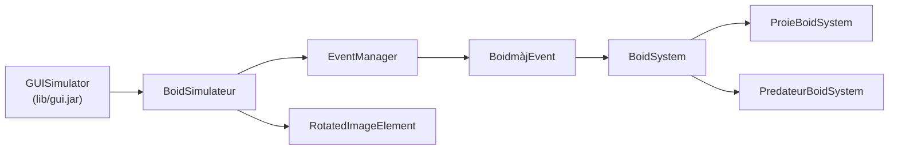
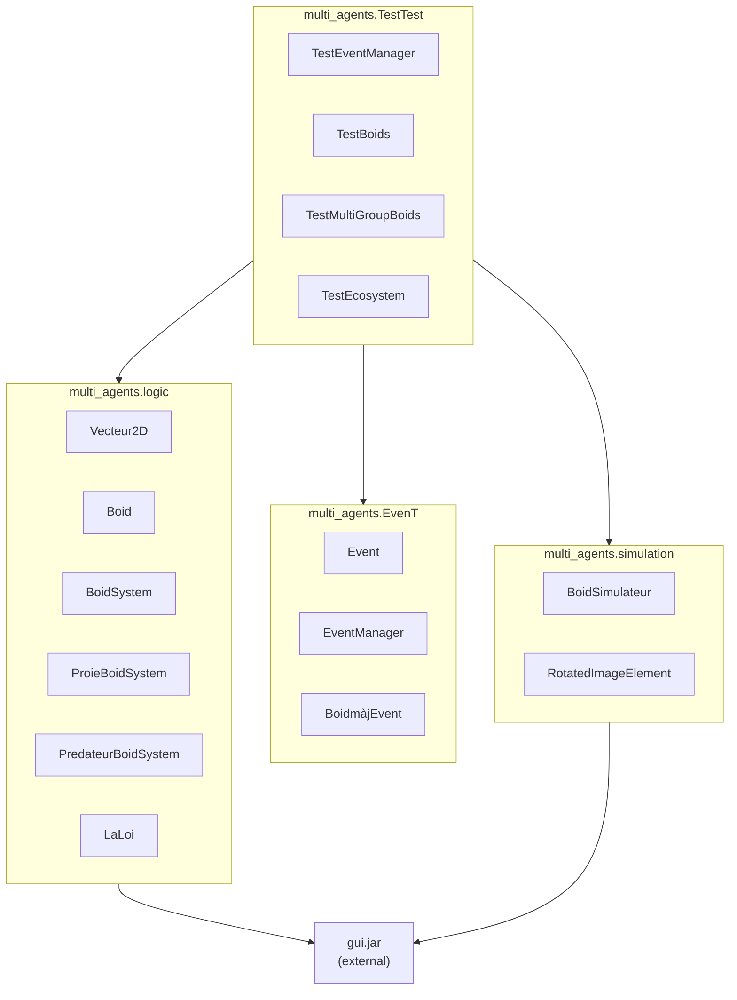

# ARCHITECTURE — Multi‑Agents (Boids)

Vue d’ensemble fusionnée (texte + diagrammes) de l’architecture, des relations et des flux. Les noms reflètent le code actuel (français). Une table de correspondance est fournie vis‑à‑vis d’anciens noms utilisés dans certains documents.

## 1) Correspondance de noms

| Historique (docs)  | Code actuel          |
|--------------------|----------------------|
| AbstractBoidSystem | BoidSystem           |
| PreyBoidSystem     | ProieBoidSystem      |
| PredatorBoidSystem | PredateurBoidSystem  |
| BoidSimulator      | BoidSimulateur       |
| BoidUpdateEvent    | BoidmàjEvent         |

## 2) Découpage en packages

```text
multi_agents/
  logic/      Boid, Vecteur2D, LaLoi, BoidSystem, ProieBoidSystem, PredateurBoidSystem
  EvenT/      Event, EventManager, BoidmàjEvent
  simulation/ BoidSimulateur, RotatedImageElement
  TestTest/   TestBoids, TestMultiGroupBoids, TestEcosystem
```

## 3) Vue composants (overview)

```text
┌──────────────┐     ┌──────────────────┐     ┌────────────────┐
│ GUISimulator │ ───▶│ BoidSimulateur   │ ───▶│ EventManager   │
│ (lib/gui.jar)│     │  draw(), addSys  │     │ PriorityQueue  │
└──────────────┘     └──────────────────┘     └────────────────┘
        │                      │                          │
        ▼                      ▼                          ▼
┌────────────────┐     ┌────────────────┐      ┌────────────────┐
│RotatedImage... │     │  BoidSystem    │ ◀─── │  BoidmàjEvent  │
│ paint(), tint  │     │  step(), reInit│  exec│  execute(),    │
└────────────────┘     └────────────────┘      │  self-schedule │
                       ▲        ▲              └────────────────┘
                ┌──────┘        └──────┐
                ▼                       ▼
        ┌──────────────┐        ┌─────────────────┐
        │ProieBoidSystem│        │PredateurBoid...│
        └──────────────┘        └─────────────────┘
```

## 4) Relations de classes (UML texte)

```text
Simulable (lib)
  ▲ implements
BoidSimulateur ────── uses ───▶ EventManager, RotatedImageElement
  │ draws
  ▼
BoidSystem (abstract) ── has ─▶ List<Boid> ── uses ─▶ LaLoi (cohésion/alignement/séparation…)
  ├── ProieBoidSystem   (fuite, repro, énergie)
  └── PredateurBoidSystem (chasse, énergie)

Boid (position, vitesse, accel, Vmax, Fmax, energie, age, vivant)
```

## 5) Flux d’exécution (date‑driven)

```text
User clique « Next »
  → BoidSimulateur.next()
    → EventManager.next()  (prend l’événement le plus tôt)
      → BoidmàjEvent.execute()
          1) (optionnel) adapter bounds au panneau GUI
          2) system.step()  (calcule forces selon LaLoi, limite F/V, màj boids)
          3) simulator.draw()  (reset + RotatedImageElement pour chaque boid vivant,
                                teinte assombrie si énergie < 30)
          4) manager.addEvent(date+delay, …)  (auto‑replanification)
```

## 6) Exécution multi‑groupes (rythmes distincts)

```text
Date 0:  proies   (prochain: 1)
Date 0:  prédateurs (prochain: 3)
Date 1:  proies   (prochain: 2)
Date 3:  proies & prédateurs …
▲ proies: delay 1 (rapide)     ▲ prédateurs: delay 3 (plus lent)
```

## 7) Données et règles (synthèse)

- LaLoi (local): cohésion, alignement, séparation, fuite/poursuite, vagabondage, champ de vision
- Contraintes: `Fmax` (forces), `Vmax` (vitesses)
- Bornes: rebonds, dimensions synchronisées avec la fenêtre
- Écosystème: proies (métabolisme 0.1, reproduction seuils 80/50, 2%, coût 30),
  prédateurs (métabolisme 0.5, +40 à la capture, dist<10), mort énergie=0

## 8) Multi‑groupes et couplage

- `BoidSimulateur.addSystem(system, color, delay)` enregistre le système et planifie un `BoidmàjEvent`
- `BoidSimulateur.linkSystems()` partage la liste des autres systèmes → interactions proies/prédateurs sans couplage fort

## 9) Bénéfices architecturaux

- Modulaire: séparation `logic` / `EvenT` / `simulation`
- Extensible: ajouter un type via une sous‑classe de `BoidSystem`
- Flexible: poids/paramètres par système, fréquences indépendantes
- Maintenable: responsabilités claires, rendu centralisé

## 10) Légende (diagrammes)

```text
│ dépendance/appel   ▼ flux   △ héritage   ═ flux de contrôle   * abstrait   # protected   + public
```

## 11) Dépendances entre packages

```text
┌─────────────────────────────────────────────────────────┐
│                  multi_agents.TestTest                  │
│  • TestEventManager                                     │
│  • TestBoids                                            │
│  • TestMultiGroupBoids                                  │
│  • TestEcosystem                                        │
└─────────────────────────────────────────────────────────┘
         │
         │ imports
         ▼
┌──────────────────────┐  ┌───────────────────┐  ┌────────────────────────┐
│ multi_agents.logic   │  │ multi_agents.EvenT│  │ multi_agents.simulation│
├──────────────────────┤  ├───────────────────┤  ├────────────────────────┤
│ Vecteur2D            │  │ Event             │  │ BoidSimulateur         │
│ Boid                 │  │ EventManager      │  │ RotatedImageElement    │
│ BoidSystem           │  │ BoidmàjEvent      │  └────────────────────────┘
│ ProieBoidSystem      │  └───────────────────┘
│ PredateurBoidSystem  │
│ LaLoi                │
└──────────────────────┘
  │                          │
  └──────────────────────────┴──────────────────────┐
               ▼
             ┌────────────────┐
             │    gui.jar     │
             │  (external)    │
             └────────────────┘
```

— Pour la conception détaillée des règles et de l’écosystème, voir `CONCEPTION.md`. Pour l’utilisation et les commandes, voir `README.md`.

## 12) Diagrammes Mermaid (rendu GitHub)

### 12.1 Composants



### 12.2 Relations de classes

```mermaid
classDiagram
    direction TB
    class Simulable {<<interface>>
      +next()
      +restart()
    }
    class BoidSimulateur {
      +addSystem(system, color, delay)
      +linkSystems()
      +draw()
      -manager: EventManager
      -systems: Map<BoidSystem, Color>
    }
    class EventManager {
      +addEvent(...)
      +next()
      +restart()
    }
    class BoidmàjEvent {
      +execute()
      -system: BoidSystem
      -simulator: BoidSimulateur
      -delay: long
    }
    class BoidSystem {<<abstract>>
      List<Boid>
      +step()
      +reInit(nb)
      +setinterGroups(List)
    }
    class ProieBoidSystem
    class PredateurBoidSystem
    class Boid {
      position
      vitesse
      accel
      Vmax
      Fmax
      energie
      age
      vivant
    }
    class LaLoi {"static rules"}
    class RotatedImageElement {+paint(Graphics2D)}

    Simulable <|.. BoidSimulateur
    BoidSimulateur --> EventManager
    BoidSimulateur --> RotatedImageElement
    EventManager o--> BoidmàjEvent
    BoidmàjEvent --> BoidSystem
    BoidSystem <|-- ProieBoidSystem
    BoidSystem <|-- PredateurBoidSystem
    BoidSystem --> Boid
    BoidSystem --> LaLoi
```

### 12.3 Flux d’événements

```mermaid
flowchart TD
    A[User clique "Next"] --> B[BoidSimulateur.next()]
    B --> C[EventManager.next()]
    C --> D[BoidmàjEvent.execute()]
    D --> E[system.step()\n(règles LaLoi, limites F/V, màj boids)]
    D --> F[simulator.draw()\n(reset + rendu boids vivants\n(teinte si énergie < 30))]
    D --> G[EventManager.addEvent(date+delay)]
```

### 12.4 Dépendances entre packages



## 13) Communication runtime entre packages 

- Initialisation
  - `Test*` crée `GUISimulator`, puis `BoidSimulateur` et un ou plusieurs systèmes (`ProieBoidSystem`, `PredateurBoidSystem`).
  - `BoidSimulateur.addSystem(system, color, delay)` enregistre chaque système et planifie son premier `BoidmàjEvent` via `EventManager.addEvent(...)`.
  - `BoidSimulateur.linkSystems()` fournit à chaque système la liste des autres pour activer les interactions inter‑groupes (fuite/chasse) sans couplage fort.

- Boucle d’exécution (à chaque « Next »)
  - `BoidSimulateur.next()` délègue à `EventManager.next()`.
  - L’événement le plus tôt (`BoidmàjEvent`) exécute `system.step()` puis `simulator.draw()` et se replanifie (`addEvent(date+delay, ...)`).

- Rendu
  - `draw()` efface la scène (`gui.reset()`) et dessine chaque boid vivant avec `RotatedImageElement`.
  - La couleur est assombrie si l’énergie < 30 ; si l’image n’est pas trouvée, un cercle de secours est dessiné.
