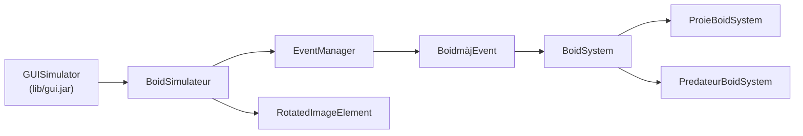
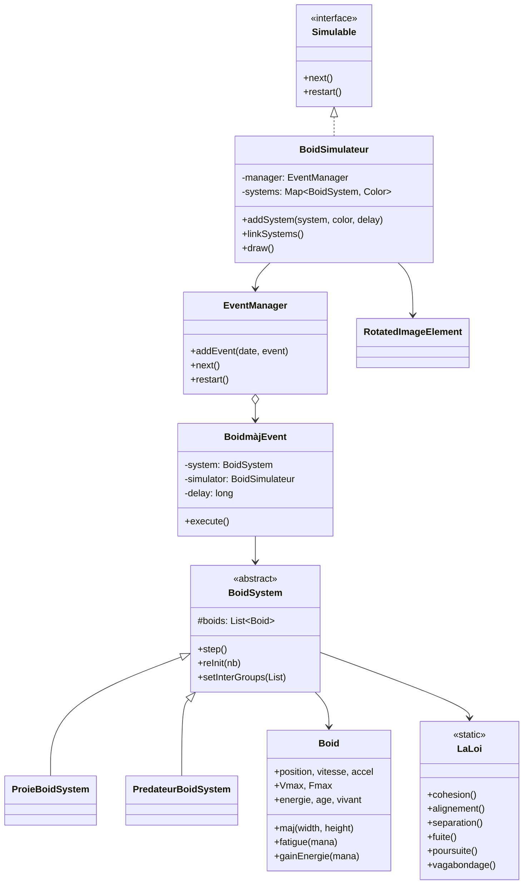
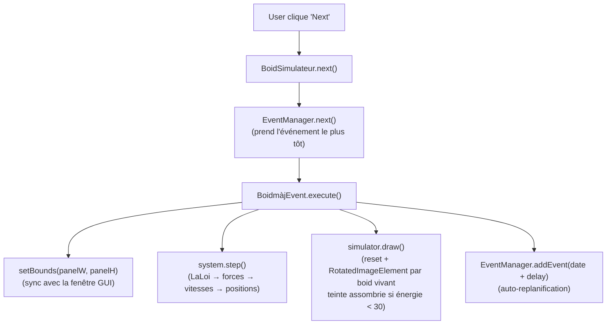
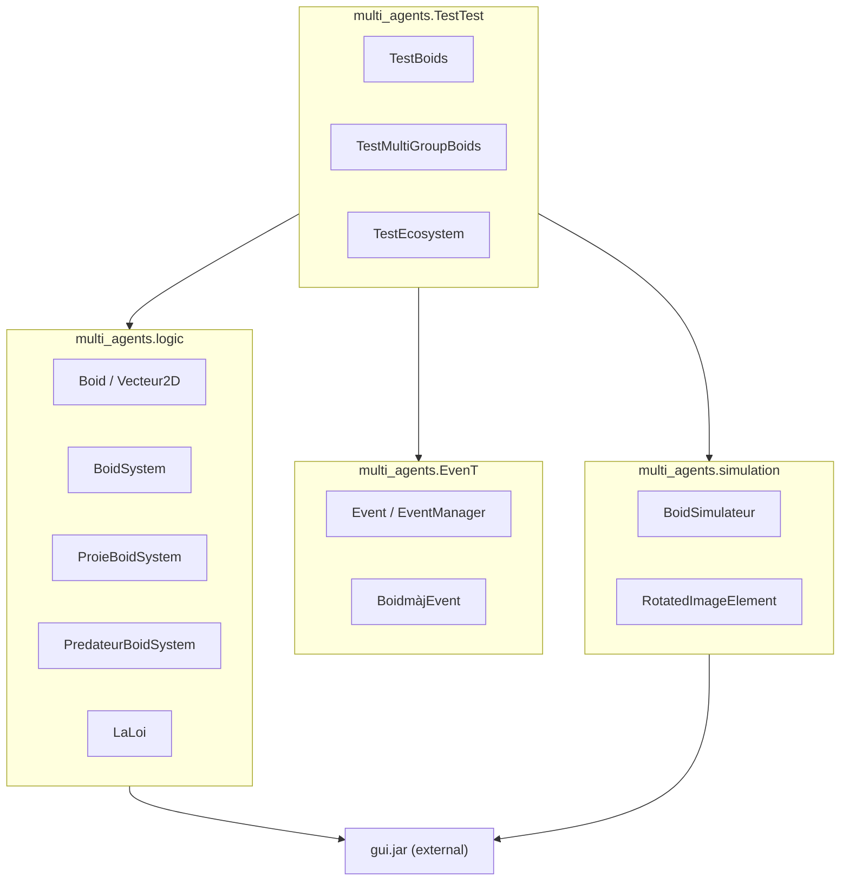

# ARCHITECTURE — Multi-Agents (Boids)

Vue d'ensemble de l'architecture, des relations de classes, et des flux d'exécution.

---

## Packages

```text
multi_agents/
  logic/       Boid, Vecteur2D, LaLoi, BoidSystem, ProieBoidSystem, PredateurBoidSystem
  EvenT/       Event, EventManager, BoidmàjEvent
  simulation/  BoidSimulateur, RotatedImageElement
  TestTest/    TestBoids, TestMultiGroupBoids, TestEcosystem
```

---

## Composants


```mermaid
flowchart LR
    GUISimulator["GUISimulator\n(lib/gui.jar)"] --> BoidSimulateur
    BoidSimulateur --> EventManager
    BoidSimulateur --> RotatedImageElement
    EventManager --> BoidmajEvent["BoidmàjEvent"]
    BoidmajEvent --> BoidSystem
    BoidSystem --> ProieBoidSystem
    BoidSystem --> PredateurBoidSystem
```

---

## Relations de classes


```mermaid
classDiagram
    direction TB
    class Simulable {
        <<interface>>
        +next()
        +restart()
    }
    class BoidSimulateur {
        -manager: EventManager
        -systems: Map~BoidSystem, Color~
        +addSystem(system, color, delay)
        +linkSystems()
        +draw()
    }
    class EventManager {
        +addEvent(date, event)
        +next()
        +restart()
    }
    class BoidmàjEvent {
        -system: BoidSystem
        -simulator: BoidSimulateur
        -delay: long
        +execute()
    }
    class BoidSystem {
        <<abstract>>
        #boids: List~Boid~
        +step()
        +reInit(nb)
        +setInterGroups(List)
    }
    class Boid {
        +position, vitesse, accel
        +Vmax, Fmax
        +energie, age, vivant
        +maj(width, height)
        +fatigue(mana)
        +gainEnergie(mana)
    }
    class LaLoi {
        <<static>>
        +cohesion()
        +alignement()
        +separation()
        +fuite()
        +poursuite()
        +vagabondage()
    }

    Simulable <|.. BoidSimulateur
    BoidSimulateur --> EventManager
    BoidSimulateur --> RotatedImageElement
    EventManager o--> BoidmàjEvent
    BoidmàjEvent --> BoidSystem
    BoidSystem <|-- ProieBoidSystem
    BoidSystem <|-- PredateurBoidSystem
    BoidSystem --> Boid
    BoidSystem --> LaLoi
```

---

## Flux d'exécution


```mermaid
flowchart TD
    A["User clique 'Next'"] --> B["BoidSimulateur.next()"]
    B --> C["EventManager.next()\n(prend l'événement le plus tôt)"]
    C --> D["BoidmàjEvent.execute()"]
    D --> E1["setBounds(panelW, panelH)\n(sync avec la fenêtre GUI)"]
    D --> E2["system.step()\n(LaLoi → forces → vitesses → positions)"]
    D --> E3["simulator.draw()\n(reset + RotatedImageElement par boid vivant\nteinte assombrie si énergie < 30)"]
    D --> E4["EventManager.addEvent(date + delay)\n(auto-replanification)"]
```

---

## Rythmes multi-groupes

Chaque système tourne à sa propre fréquence (paramètre `delay`) :

```text
Date 0 : proies      (delay 1) → prochain à date 1
Date 0 : prédateurs  (delay 3) → prochain à date 3
Date 1 : proies                → prochain à date 2
Date 3 : proies + prédateurs  → ...
```

---

## Dépendances entre packages


```mermaid
flowchart TB
    subgraph TestTest["multi_agents.TestTest"]
        T1[TestBoids]
        T2[TestMultiGroupBoids]
        T3[TestEcosystem]
    end

    subgraph Logic["multi_agents.logic"]
        L1[Boid / Vecteur2D]
        L2[BoidSystem]
        L3[ProieBoidSystem]
        L4[PredateurBoidSystem]
        L5[LaLoi]
    end

    subgraph EvenT["multi_agents.EvenT"]
        E1[Event / EventManager]
        E2[BoidmàjEvent]
    end

    subgraph Simulation["multi_agents.simulation"]
        S1[BoidSimulateur]
        S2[RotatedImageElement]
    end

    GUI["gui.jar (external)"]

    TestTest --> Logic
    TestTest --> EvenT
    TestTest --> Simulation
    Logic --> GUI
    Simulation --> GUI
```

---

## Communication runtime

**Initialisation**

1. `Test*` crée `GUISimulator`, puis `BoidSimulateur` et les systèmes.
2. `addSystem(system, color, delay)` enregistre chaque système et planifie son premier `BoidmàjEvent`.
3. `linkSystems()` fournit à chaque système la liste des autres → interactions inter-groupes sans couplage fort.

**Boucle (à chaque « Next »)**

1. `BoidSimulateur.next()` délègue à `EventManager.next()`.
2. `BoidmàjEvent.execute()` : sync bounds → `step()` → `draw()` → replanifie.

**Rendu**

- `draw()` efface la scène et dessine chaque boid vivant via `RotatedImageElement`.
- Couleur assombrie si énergie < 30 ; cercle de secours si l'image sprite est absente.
